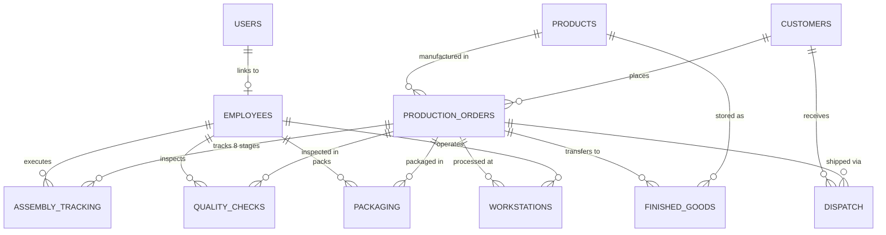

# Ball Pen Assembly Line Production Tracking System (MES)

A modern, full-stack Manufacturing Execution System (MES) and Shop-Floor Production Tracking platform tailored for small-to-medium ball pen manufacturing companies.

Built specifically as a **Final Year Engineering Capstone / Major Project & Portfolio Showcase** using **Spring Boot 3 (Java 21)** and **React 18 (Vite + Tailwind CSS)**.

---

## 🎯 Executive Summary & Problem Solved

Traditional pen manufacturing workshops rely heavily on paper batch cards and whiteboard tallies, resulting in:
- Blind spots during multi-stage assembly (ink filling, tip pressing, cap snapping).
- Inaccurate raw material tracking leading to stockouts of refills, tungsten carbide tips, or barrels.
- High defect escape rates due to disconnected quality inspection benches.
- Warehouse discrepancies between packaged lots and client dispatch schedules.

**Ball Pen MES** eliminates these bottlenecks by digitizing the complete lifecycle:
```
Raw Materials ➔ 8-Stage Assembly Pipeline ➔ QC Inspection ➔ Packaging ➔ Finished Goods ➔ Outbound Dispatch
```

---

## 🚀 Approved Technology Stack

### Backend
- **Language**: Java 21 (LTS)
- **Framework**: Spring Boot 3.3.4
- **Database**: MySQL 8.0 (13 normalized relational tables)
- **Security**: Spring Security + JWT (JJWT 0.12.6, HMAC-SHA256) + BCrypt Password Encoding
- **ORM / Persistence**: Spring Data JPA + Hibernate 6
- **Validation**: Bean Validation (`@Valid`, `@NotNull`, `@Size`, `@Min`)
- **Boilerplate Reduction**: Lombok (`@Getter`, `@Setter`, `@Builder`, `@RequiredArgsConstructor`)
- **API Documentation**: SpringDoc OpenAPI 3 (Interactive Swagger UI at `/swagger-ui.html`)
- **Build Tool**: Maven 3.9+
- **Port**: `8080`

### Frontend
- **Framework**: React 18 (Vite 5)
- **Language**: JavaScript ES6+ (Clean, modern JS — no TypeScript)
- **Styling**: Tailwind CSS (Factory slate & industrial indigo palette)
- **State Management**: Redux Toolkit (`authSlice`, `store.js`)
- **Routing**: React Router DOM (v6) with Protected Routes & Role Guards
- **Form Handling & Validation**: Formik + Yup schemas
- **Icons**: Lucide React
- **Data Visualization**: Recharts (Production Area Charts, Defect Bar Charts, Order Status Donut Charts)
- **Notifications**: React Hot Toast
- **Port**: `5173`

---

## ⚙️ The 8-Stage Pen Manufacturing Pipeline

Every production batch follows an industry-realistic 8-stage assembly sequence:

| Step | Stage | Machine / Bench | Manufacturing Operation |
| :---: | :--- | :--- | :--- |
| **1** | **Material Collection** | Kitting Bench | Issuance of barrels, refill tubes, tungsten carbide tips, safety caps, and ink. |
| **2** | **Refill Preparation** | Centrifuge Cell | Injection of high-viscosity ink into plastic tubes followed by centrifuge air-bubble removal (3500 RPM). |
| **3** | **Barrel Assembly** | Pneumatic Inserter | Mechanical insertion and seating of the ink refill inside the outer plastic pen barrel. |
| **4** | **Tip Installation** | Hydraulic Press | Precision press-fit of the 0.7mm tungsten carbide ball tip with calibrated seat pressure. |
| **5** | **Cap Assembly** | Snap-Fitting Jig | Ultrasonic / snap-lock fastening of the ventilated safety cap with tactile click seal verification. |
| **6** | **Quality Check** | Optical & Write Bench | Continuous optical scanner verification, automated write-smoothness test, and ink-leak audit. |
| **7** | **Packaging** | Master Boxing Line | Grouping into 10-pen retail blister packs or 100-pen corrugated master cartons with barcodes. |
| **8** | **Finished Goods** | Warehouse Staging | Pallet storage in designated warehouse bays (e.g. Bay-A / Shelf-02), ready for shipping. |

---

## 📊 Complete Module Directory (All 13 Modules)

1. **Authentication & Authorization**: Role-based access control (Admin, Supervisor, Operator) with JWT authentication and auto-token refresh.
2. **Dashboard & KPIs**: Real-time factory metrics (Active Orders, Daily Output, QC Pass Rate, Workstations Running, Material Stockouts, Inventory Valuation) with Recharts graphs.
3. **Employees Management**: Factory workforce directory, department tracking (Management, Assembly Line, QC, Warehouse), roles, and active status toggles.
4. **Customers Directory**: Wholesale buyers, retail stationers, and corporate clients with contact management.
5. **Products Catalog**: Ballpoint, Gel, and Rollerball pens with ink colors (Blue, Black, Red, Green), selling prices, and specifications.
6. **Raw Materials Inventory**: Barrels, refills, tips, caps, ink liters, and packaging boxes with live low-stock alerts and delta stock adjustments.
7. **Production Orders**: Batch planning, quantity goals, target due dates, priorities (High, Medium, Low), and automatic 8-stage assembly queue generation.
8. **Workstations Monitoring**: Shop-floor physical cells (WS-01 to WS-07), operational states (Idle, Running, Maintenance, Offline), and assigned operator / batch allocation.
9. **Assembly Tracking**: Interactive visual timeline tracking each batch through the 8 assembly stages with start/complete timestamps, elapsed duration, and operator notes.
10. **Quality Control & Defect Analysis**: Formal batch inspections, tested vs passed vs rejected tallies, pass yield % calculation, and defect root-cause classification.
11. **Packaging Line**: Carton boxing, blister packaging, and pallet staging with automatic warehouse receipt generation.
12. **Finished Goods Inventory**: Warehouse bay allocation, stock valuations (INR), and one-click "Ready for Dispatch" staging toggles.
13. **Outbound Dispatch & Fulfillment**: Client shipment bookings, courier assignment (BlueDart, Delhivery, DTDC), AWB tracking numbers, and live delivery status updates.
14. **Reports & Analytics**: Tabular audit sheets for Production, Quality, Warehouse Valuation, Logistics, and Executive KPI Summary with CSV export and printable PDF layout.

---

## 🗄️ Database Architecture (13 Tables)



---

## 🔑 Pre-Seeded Demonstration Accounts

For instant viva testing, project presentation, and examiner demonstration:

| Role | Username | Password | Permissions |
| :--- | :--- | :--- | :--- |
| **Plant Admin** | `admin` | `admin123` | Full administrative control, user management, deletion rights, and reports. |
| **Floor Supervisor** | `supervisor` | `supervisor123` | Order creation, workstation allocation, QC audits, and dispatch operations. |
| **Line Operator** | `operator` | `operator123` | Live stage execution, workstation status toggling, and packaging logs. |

*(The login page includes convenient 1-click Quick-Fill buttons for each role).*

---

## 🛠️ How to Run Locally

### Prerequisites
- Java 21 JDK installed (`java -version`)
- Node.js 18+ and npm installed (`node -v`, `npm -v`)
- MySQL Server 8.0 running on `localhost:3306`

### 1. Database Initialization
In MySQL Workbench or command line:
```sql
CREATE DATABASE IF NOT EXISTS ball_pen_mes_db;
```

### 2. Run Backend Server
```powershell
cd backend
mvn clean spring-boot:run
```
- Backend will start on `http://localhost:8080`.
- Automatic `DataInitializer` seeds complete factory data on first run.
- Swagger API Docs: `http://localhost:8080/swagger-ui.html`.

### 3. Run Frontend Server
```powershell
cd frontend
npm install
npm run dev
```
- Frontend will start on `http://localhost:5173`.
- Open browser at `http://localhost:5173` and sign in with demo accounts.

---

## 🎓 Viva Voce & Project Defense Q&A Guide

### Q1: Why did you build an MES specifically for Ball Pen Manufacturing?
> **Answer**: High-speed stationery production requires tight synchronization between discrete assembly operations (centrifuging ink refills, tip pressing, cap locking) and batch quality tolerances. Ball pens present a classic multi-stage assembly engineering problem where defective ink or damaged tips propagate downstream unless tracked stage-by-stage.

### Q2: How does the system handle concurrent workstation status updates?
> **Answer**: In the backend, Spring Data JPA with `@Transactional` ensures atomic persistence when updating workstation allocations and stage milestones. In the database, normalized foreign keys ensure referential integrity, while the REST APIs use DTOs to encapsulate update requests safely.

### Q3: How is JWT authentication implemented?
> **Answer**: We use standard Spring Security 6 with a stateless filter chain. On login, `JwtTokenProvider` generates a signed HMAC-SHA256 token containing the user's ID, username, and role. The frontend stores this token in localStorage and `authSlice`, attaching it via Axios request interceptor (`Authorization: Bearer <token>`). The `JwtAuthenticationFilter` intercepts each request, validates the signature, and sets the `SecurityContext`.

### Q4: How does order completion propagate through the system?
> **Answer**: When an order is created, 8 sequential `AssemblyTracking` milestones are automatically generated in `PENDING` state. As operators advance each stage, timestamps and yield notes are logged. When the 8th stage (`FINISHED_GOODS`) completes, the system marks the `ProductionOrder` as `COMPLETED`, records `producedQuantity`, and registers the lot into `finished_goods` inventory.

### Q5: What makes the frontend reactive and responsive?
> **Answer**: Built on Vite with React 18, utilizing Tailwind CSS responsive breakpoints (`sm`, `md`, `lg`, `xl`). State is cleanly isolated using Redux Toolkit for authentication and custom service layers with Axios for module data. Formik + Yup provides real-time client validation before HTTP calls, and React Hot Toast gives non-blocking feedback.

---

## 📜 License
Developed for academic assessment, engineering portfolio, and campus recruitment demonstrations. Free to adapt and extend.
